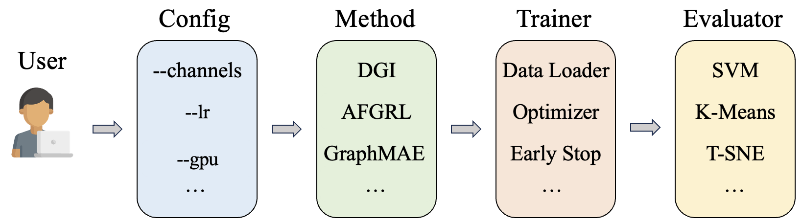

Introduction
============

SSL and PyG-SSL
-----------------
(Semi-)Supervised Learning algorithms often rely on heavy label information, which is expensive to obtain. 
Self-Supervised Learning (SSL) is a promising alternative, which aims to learn representations from the data itself. 
SSL has been widely studied in the context of images and text, but has only recently been extended to graph-structured data. 
PyG-SSL is a PyTorch Geometric-based library for self-supervised learning on graphs. 
It provides a collection of popular benchmark datasets, evaluation metrics, and self-supervised learning algorithms, which can be used to learn node and graph representations 
from graph-structured data. PyG-SSL is built on top of PyTorch Geometric, which is a popular library for graph neural networks. 
PyG-SSL is designed to be easy to use, and can be easily integrated into existing PyTorch Geometric-based projects.

\
Generally, PyG-SSL have four components: Configuration, Method, Trainer and Evaluator. The user only needs to specify the configuration and write a simple script which calls the other components within this framework. 
The library will automatically run the method, train the model, and evaluate the results. The user can also customize the method, trainer, and evaluator to fit their own needs. We provide example configurations in the configuration folder
, and example scripts in the root folder. The user can easily modify these configurations and scripts to run their own experiments.

Generally, self-supervised learning works with the following flow: (1) prepare the data and apply necessary pre-transforms. (2) Define your encoder, such as GCN, GAT, etc. (3) Define 
your self-supervised learning method, such as DGI, GraphCL, etc. (4) connect the data and encoder to the method and run training. After which you'll have a encoder which can be used to generate representations. (5) For specific downstream tasks,
define a classifier (such as MLP) or regressor and train it on the labeled data's representations generated by the encoder.

PyG-SSL do not execute (5) because the downstream original tasks for different methods are different, so do the original classifiers. However, PyG-SSL provides simple APIs to fairly test the trained encoder in general. We provide evaluators 
based on SVM, K-Means, T-SNE, linear regression, etc, 

Citing
---------------------

If you find PyG-SSL useful in your research, please consider citing the following paper:

.. code-block:: bibtex

   @article{pygssl,
     title={PyG-SSL: A PyTorch Geometric-based Library for Self-Supervised Learning on Graphs},
     author={Anonymous Authors},
     journal={arXiv preprint arXiv: xxxx.xxxxx},
     year={2024}
   }

PyG-SSL not only includes the algorithms themselves, but also the benchmark datasets and evaluation metrics. The integrated datasets are:

**ToDo**
